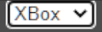
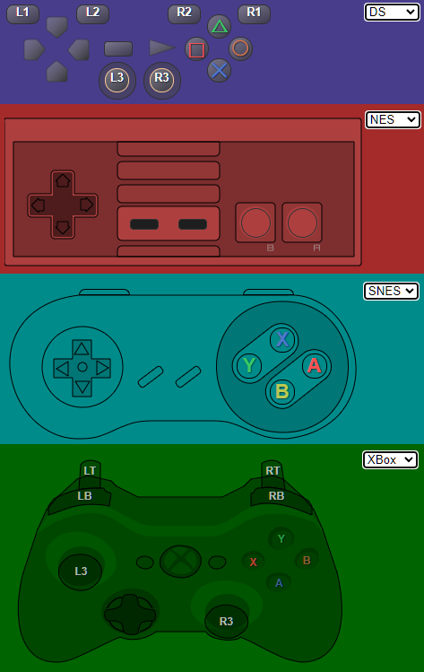

# JS-DualShock3-Monitor

Pure javascript-driven gamepad monitor (styled for Dualshock 3, NES, SNES, XBox 360)

Built to be used in OBS an an overlay.
That means the controller will be semi-transparent.
Compatible with any XInput device (xbox controllers, Mayflash Magic adapters in XInput mode, etc)

## How to use

- Add a browser source
- Set page size to 500x400
- Tick the "Local File" box
- Click "Browse" and select the index.html from this repo
- Tick the "Shutdown source when not visible" box
- Tick the "Refresh browser when scene becomes active" box
- Make suse the browser source has `body { background-color: rgba(0, 0, 0, 0); margin: 0px auto; overflow: hidden; }` in the `Custom CSS` field

### To change styles:
- Right click your browser source
- Pick the "Ineteract" options
- Click on dropdown list utill it's open. Note that you won't see any actual items, instead there will be thick border inside the list 
- Use up/down arrows to chose the desired style

