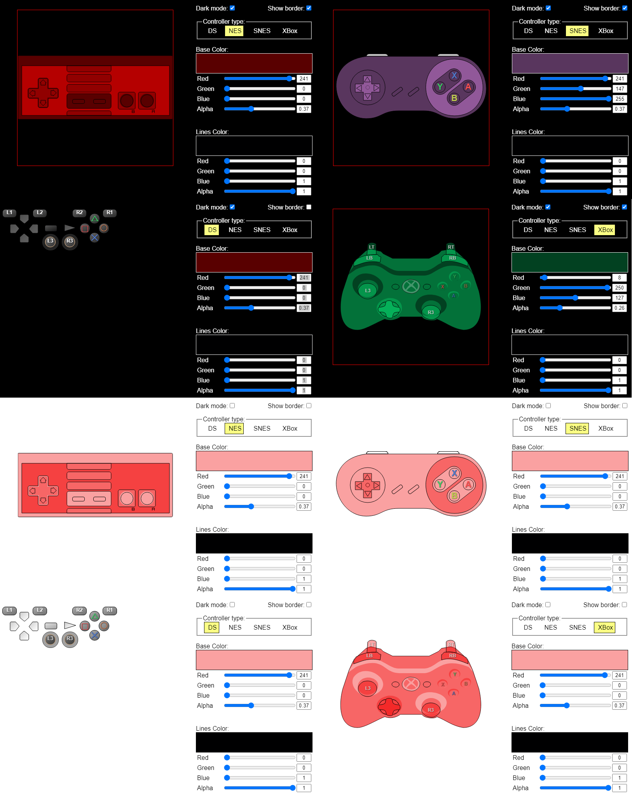

# JS-DualShock3-Monitor

Pure javascript-driven gamepad monitor (styled for mini-Dualshock 3, NES, SNES, XBox 360)

Built to be used in OBS an an overlay.
That means the controller will be semi-transparent.
Compatible with any XInput device (xbox controllers, Mayflash Magic adapters in XInput mode, etc)

## How to use

- Add a browser source
- Set page size to 500x400
- Tick the "Local File" box
- Click "Browse" and select the index.html from this repo
- Tick the "Shutdown source when not visible" box
- Tick the "Refresh browser when scene becomes active" box
- Make suse the browser source has `body { background-color: rgba(0, 0, 0, 0)!important; overflow: hidden; }` in the `Custom CSS` field

### To change styles:
- Right click your browser source
- Pick the "Ineteract" options
- Select "Controller type"
- Adjust strokes and fill colors using sliders

### Flatpack OBS
Flatpack OBS is a weird beast (as all flatpacks surely are), but many consider it to be the only way to use OBS on their Linux system.
At least on Manjaro, the default "permissions" of flatpacks disallow controller access.
That *is* fixable, but [opens a can of worms of its own](https://docs.flatpak.org/en/latest/sandbox-permissions.html). 
If you're okay with that, add `--filesystem=/run/udev --device=all` to your .desktop file/launch script.<br>
Mine ended up looking like this:
```
/usr/bin/flatpak run --filesystem=/run/udev --device=all --branch=stable --arch=x86_64 --command=obs com.obsproject.Studio
```

### Screenshots

